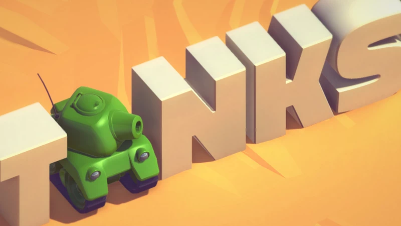

# UnityKit

[](https://swift.org)
[](https://developer.apple.com/ios/)
[](LICENSE)
[](#testing)

A Swift framework that brings Unity3D's familiar API and coding patterns to iOS development. Built on top of SceneKit, UnityKit allows developers experienced with Unity to write iOS games using the same concepts, components, and lifecycle methods they already know.

## Why UnityKit?

- **Familiar Unity API**: Use GameObject, MonoBehaviour, Transform, Rigidbody, and other Unity concepts in Swift
- **Follow C# Tutorials**: Take Unity tutorials written in C# and implement them in Swift with minimal translation
- **SceneKit Foundation**: Built on Apple's SceneKit for high-performance 3D rendering
- **Multiple Scenes**: Run multiple scenes simultaneously - something Unity can't do on iOS
- **Production Ready**: Comprehensive test suite with 399 tests covering critical functionality
- **Modern Swift**: Written in Swift 5.9+ with a clean, type-safe API

## Requirements

- iOS 13.0+
- Xcode 14.0+
- Swift 5.9+

## Installation

### Swift Package Manager (Recommended)

Add UnityKit to your project via Xcode:

1. In Xcode, go to **File > Add Package Dependencies**
2. Enter the repository URL: `https://github.com/salt-pepper-code/UnityKit.git`
3. Select the version or branch you want to use
4. Click **Add Package**

Or add it to your `Package.swift`:

```swift
dependencies: [
    .package(url: "https://github.com/salt-pepper-code/UnityKit.git", from: "1.1.2")
]
```

Then import wherever needed:

```swift
import UnityKit
```

### Carthage

Add UnityKit to your `Cartfile`:

```
github "salt-pepper-code/unitykit" "master"
```

Run:

```bash
carthage update
```

In your application target's **General** tab, drag `UnityKit.framework` from `Carthage/Build/iOS` to **Linked Frameworks and Libraries**.

## Quick Start

### 1. Set Up Your View

```swift
import UnityKit

class GameViewController: UIViewController {
    override func loadView() {
        // Simple setup
        self.view = UI.View.makeView()

        // Or with a custom scene file and options
        // self.view = UI.View.makeView(
        //     sceneName: "Scene.scn",
        //     options: UI.View.Options(showsStatistics: true)
        // )
    }

    var sceneView: UI.View {
        return self.view as? UI.View ?? UI.View(frame: .zero)
    }
}
```

### 2. Access the Scene

```swift
// Scene uses singleton pattern by default
guard let scene = Scene.shared else { return }

// Or access via the view
guard let scene = sceneView.sceneHolder else { return }
```

### 3. Create GameObjects

```swift
// Empty GameObject
let gameManager = GameObject(name: "GameManager")
scene.addGameObject(gameManager)

// GameObject with primitive shape
let cube = GameObject.createPrimitive(
    .cube(width: 20, height: 20, length: 20, chamferRadius: 0, name: "MyCube")
)
scene.addGameObject(cube)
```

**Available Primitives:**

```swift
.sphere(radius: Float, name: String?)
.capsule(capRadius: Float, height: Float, name: String?)
.cylinder(radius: Float, height: Float, name: String?)
.cube(width: Float, height: Float, length: Float, chamferRadius: Float, name: String?)
.plane(width: Float, height: Float, name: String?)
.floor(width: Float, length: Float, name: String?)
```

### 4. Create Components

Just like Unity, create custom behavior by subclassing `MonoBehaviour`:

```swift
class PlayerController: MonoBehaviour {
    var speed: Float = 10.0

    override func start() {
        Debug.info("Player controller started!")
    }

    override func update() {
        // Handle movement
        if Input.getKey(.w) {
            transform.position += transform.forward * speed * Time.deltaTime
        }
    }

    override func onCollisionEnter(_ collision: Collision) {
        Debug.info("Collided with \(collision.gameObject.name)")
    }
}
```

Add components to GameObjects:

```swift
let player = GameObject(name: "Player")
player.addComponent(PlayerController.self)
scene.addGameObject(player)
```

## Core Features

### MonoBehaviour Lifecycle

UnityKit implements the familiar Unity lifecycle methods:

```swift
class MyBehaviour: MonoBehaviour {
    /// Called when the script instance is being loaded
    override func awake() { }

    /// Called before the first frame update
    override func start() { }

    /// Called every frame before rendering
    override func preUpdate() { }

    /// Called every frame after rendering
    override func update() { }

    /// Called every fixed timestep (for physics)
    override func fixedUpdate() { }

    /// Called after all Update functions
    override func lateUpdate() { }
}
```

### Event Methods

```swift
/// Called when the component is enabled
override func onEnable() { }

/// Called when the component is disabled
override func onDisable() { }

/// Called when this collider/rigidbody begins touching another
override func onCollisionEnter(_ collision: Collision) { }

/// Called when this collider/rigidbody stops touching another
override func onCollisionExit(_ collision: Collision) { }

/// Called when a collider enters a trigger collider
override func onTriggerEnter(_ collider: Collider) { }

/// Called when a collider exits a trigger collider
override func onTriggerExit(_ collider: Collider) { }
```

### Transform System

```swift
let obj = GameObject(name: "MyObject")

// Position, rotation, scale
obj.transform.position = Vector3(0, 10, 0)
obj.transform.rotation = Quaternion.euler(0, 45, 0)
obj.transform.localScale = Vector3(2, 2, 2)

// Direction vectors
let forward = obj.transform.forward
let right = obj.transform.right
let up = obj.transform.up

// Look at target
obj.transform.lookAt(target: targetObject.transform)

// Hierarchy
parent.addChild(child)
child.parent = parent
```

### Physics System

```swift
// Add Rigidbody for physics
let rb = gameObject.addComponent(Rigidbody.self)
rb?.mass = 10.0
rb?.useGravity = true

// Add Colliders
let boxCollider = gameObject.addComponent(BoxCollider.self)
boxCollider?.set(size: Vector3(1, 1, 1))

let sphereCollider = gameObject.addComponent(SphereCollider.self)
sphereCollider?.set(radius: 0.5)

// Raycasting
if let hit = Physics.Raycast(
    origin: transform.position,
    direction: transform.forward,
    maxDistance: 100,
    layerMask: .all
) {
    Debug.info("Hit \(hit.gameObject.name) at distance \(hit.distance)")
}

// Overlap queries
let nearbyObjects = Physics.overlapSphere(
    center: transform.position,
    radius: 10.0,
    layerMask: .all
)
```

### Input System

```swift
class InputController: MonoBehaviour {
    override func update() {
        // Keyboard
        if Input.getKey(.space) {
            // Space is being held
        }

        if Input.getKeyDown(.w) {
            // W was just pressed this frame
        }

        if Input.getKeyUp(.s) {
            // S was just released this frame
        }

        // Mouse
        if Input.getMouseButton(0) {
            // Left mouse button held
        }

        let mousePosition = Input.mousePosition

        // Check for any key
        if Input.anyKey {
            Debug.info("Any key is pressed")
        }
    }
}
```

### Coroutines & Threading

```swift
class MyBehaviour: MonoBehaviour {
    override func start() {
        // Start coroutine on background thread
        startCoroutine({
            // Heavy computation here
        }, thread: .background)

        // Queue coroutine with exit condition
        queueCoroutine((
            execute: {
                Debug.info("Executing...")
            },
            exitCondition: { timePassed in
                return timePassed >= 2.0 // Exit after 2 seconds
            }
        ), thread: .main)
    }
}
```

### Audio System

```swift
if let clip = AudioClip(fileName: "BackgroundMusic.wav", playType: .loop) {
    let audioSource = gameObject.addComponent(AudioSource.self)
    audioSource?.configure {
        $0.clip = clip
        $0.volume = 0.3
        $0.play()
    }
}
```

### Lighting & Rendering

```swift
let lightObj = GameObject(name: "MainLight")
let light = lightObj.addComponent(Light.self)
light?.configure {
    $0.type = .directional
    $0.intensity = 2000
    $0.castsShadow = true
    $0.shadowRadius = 5.0
}
scene.addGameObject(lightObj)
```

### Particle Systems

```swift
let particles = gameObject.addComponent(ParticleSystem.self)
particles?.load(fileName: "Fire.scnp", loops: true)
    .execute { system in
        // Customize particle system
    }
```

### GameObject Searching

```swift
// Find by name
let player = GameObject.find(.name(.exact("Player")), in: scene)

// Find by tag
let enemies = GameObject.findGameObjects(.tag(.custom("Enemy")), in: scene)

// Find by layer
let groundObjects = GameObject.findGameObjects(.layer(.ground), in: scene)

// Find with camera
let mainCamera = GameObject.find(.camera, in: scene)

// Find with light
let lights = GameObject.findGameObjects(.light, in: scene)

// Combined search
let results = GameObject.findGameObjects(.name(.contains("Enemy")), .layer(.default), in: scene)
```

### Time Management

```swift
class GameController: MonoBehaviour {
    override func update() {
        // Delta time since last frame
        let delta = Time.deltaTime

        // Time since game started
        let elapsed = Time.time

        // Control time scale (1.0 = normal, 0.5 = half speed, 2.0 = double speed)
        Time.timeScale = 0.5
    }
}
```

### Debug Logging

UnityKit includes a comprehensive logging system:

```swift
// Enable all logs
Debug.set(enable: .all)

// Or be selective
Debug.set(enable: .warning)
Debug.set(enable: .error)

// Log levels
Debug.debug("Debug message")
Debug.info("Info message")
Debug.warning("Warning message")
Debug.error("Error message")
```

**Available log levels:**
- `.all` - Show everything
- `.debug` - Debug messages only
- `.info` - Info and above
- `.warning` - Warnings and errors
- `.error` - Errors only
- `.none` - Silence all logs

## Components Reference

UnityKit includes these built-in components:

### Core Components
- **Transform** - Position, rotation, scale, and hierarchy
- **Camera** - Scene rendering and view controls
- **Light** - Lighting system (omni, directional, spot, ambient)
- **MeshFilter** - Geometry data
- **MeshRenderer** - Rendering properties

### Physics Components
- **Rigidbody** - Physics simulation
- **BoxCollider** - Box-shaped collision detection
- **SphereCollider** - Sphere-shaped collision detection
- **CapsuleCollider** - Capsule-shaped collision detection
- **MeshCollider** - Mesh-based collision detection
- **PlaneCollider** - Infinite plane collision detection

### Audio Components
- **AudioSource** - 3D audio playback
- **AudioClip** - Audio file management

### Special Components
- **ParticleSystem** - Particle effects
- **Vehicle** - Vehicle physics (wheels, steering, engine)

### UI Components
- **Canvas** - UI container
- **Image** - Image rendering
- **Slider** - Interactive slider control

## Testing

UnityKit has a comprehensive test suite to ensure reliability and stability:

- **399 Tests** across 20 test suites
- **Critical Framework Tests**: Transform, Scene, GameObject hierarchy, Colliders, Coroutines
- **Component Tests**: Light, ParticleSystem, Rigidbody, Camera
- **System Tests**: Physics, Input, Time, Lifecycle
- **Utility Tests**: Vector2, Vector3, Quaternion, Volume calculations

### Running Tests

Tests require an iOS Simulator. Use Xcode or command line:

```bash
# Run all tests
xcodebuild test -scheme UnityKit -destination 'platform=iOS Simulator,name=iPhone 17 Pro'

# Run specific test suite
xcodebuild test -scheme UnityKit -destination 'platform=iOS Simulator,name=iPhone 17 Pro' -only-testing:UnityKitTests/TransformTests
```

## Example Project

### Tank Demo



A complete implementation of Unity's famous Tanks Tutorial, recreated in Swift using UnityKit. Originally recorded at Unite Boston 2015, this project demonstrates:

- Player and AI tank controllers
- Physics-based projectile system
- Health and damage system
- World and screen-space UI
- Audio mixing and effects
- Game architecture patterns

**[View Tank Demo →](https://github.com/salt-pepper-code/TankDemo)**

**[Original Unity Tutorial (C#) →](https://learn.unity.com/project/tanks-tutorial)**

This demo proves you can follow Unity C# tutorials and implement them in Swift with UnityKit!

## Architecture Notes

### GameObject vs SCNNode

While `GameObject` wraps `SCNNode`, it's recommended to work with the UnityKit API rather than accessing the underlying `SCNNode` directly. Use components like `MeshFilter` to access geometry data.

### Scene Allocation

Scenes can be allocated as singletons or instances:

```swift
// Singleton (default) - accessible via Scene.shared
let scene = Scene(allocation: .singleton)

// Instance - for multiple scenes
let scene = Scene(allocation: .instantiate)
```

### Layers & Tags

Organize GameObjects using layers and tags:

```swift
// Layers (OptionSet - can combine)
gameObject.layer = .player
gameObject.layer = [.player, .default]

// Available layers: .default, .ground, .player, .environment, .projectile, .all

// Tags (Enum - single value)
gameObject.tag = .mainCamera
gameObject.tag = .custom("Enemy")
gameObject.tag = .untagged
```

## Best Practices

1. **Use Components**: Separate concerns into reusable MonoBehaviour components
2. **Lifecycle Methods**: Always call `super` when overriding lifecycle methods
3. **Component Initialization**: Call `awake()` on components in tests
4. **Physics Queries**: Use layer masks to filter physics queries for better performance
5. **Coroutines**: Use background threads for heavy computation, main thread for UI updates
6. **Memory Management**: Remove GameObjects with `destroy()` when no longer needed

## Migration from Unity

If you're coming from Unity, here are key differences:

| Unity (C#) | UnityKit (Swift) |
|------------|------------------|
| `void Start()` | `override func start()` |
| `gameObject.GetComponent<T>()` | `gameObject.getComponent(T.self)` |
| `gameObject.AddComponent<T>()` | `gameObject.addComponent(T.self)` |
| `Instantiate(prefab)` | `GameObject.instantiate(original)` |
| `Destroy(gameObject)` | `gameObject.destroy()` |
| `Vector3.zero` | `Vector3.zero` (same!) |
| `Time.deltaTime` | `Time.deltaTime` (same!) |

Most Unity concepts translate directly to UnityKit!

## Documentation

- **[GitHub Wiki](https://github.com/salt-pepper-code/UnityKit/wiki)** - Complete API documentation, examples, and guides
- **API Documentation** - Use Xcode's Quick Help (⌥ + Click) for inline documentation

## Contributing

Contributions are welcome! Please feel free to submit pull requests or open issues for bugs and feature requests.

## Credits

**Kevin Malkic** - Salt and Pepper Code Ltd

## License

UnityKit is released under the MIT license. See [LICENSE](LICENSE) for details.

---

**Made with ❤️ for Unity developers wanting to build native iOS games in Swift**
