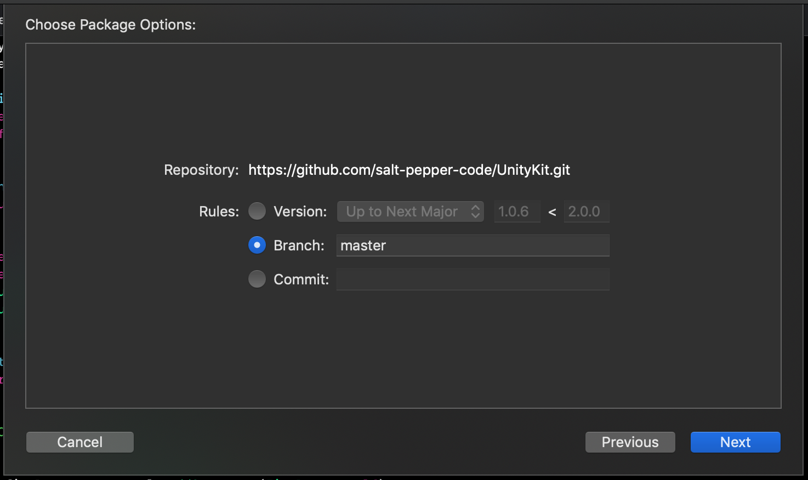

# UnityKit

The idea behind UnityKit is to replicate Unity3D coding patterns. My intention was not to improve the system but to allow any developer that is familiar with Unity already and to be able to follow C# tutorials and write it in Swift.
It uses SceneKit, UnityKit is a layer on top of it to ease the use with function that will make your life easier. 
The advantage of having this, is that you can have multiple scene running at the same time, something that Unity3D can't do on iOS.

## Requirements
- iOS 11.0+
- Xcode 11.1+
- Swift 5.0+

## Tank Demo Example
 
### Summary
Originally recorded at Unite Boston 2015, this  series will teach you how to create a 1 player shooter game. You'll learn about simple game mechanics, integrating world and screen space UI, as well as game architecture and audio mixing.
[Original Tutorial in C#](https://learn.unity.com/project/tanks-tutorial)
💥 [Tank Demo in Swift](https://github.com/salt-pepper-code/TankDemo)

## Installations
### Carthage
Add UnityKit to your Cartfile:
```
github "salt-pepper-code/unitykit" "master"
```

And then run:
```
carthage update
```
In your application targets “General” tab under the “Linked Frameworks and Libraries” section, drag and drop UnityKit.framework from the Carthage/Build/iOS directory that `carthage update` produced.

### Swift Package Manager
``` swift
// swift-tools-version:5.1

import PackageDescription

let package = Package(
    name: "UnityKit",
    platforms: [.iOS(.v11)],
    products: [
        .library(name: "UnityKit", targets: ["UnityKit"]),
    ],
    dependencies: [

    ],
    targets: [
        .target(name: "UnityKit", dependencies: [], path: "Sources"),
    ]
)
```
And then import wherever needed: ```import UnityKit```

#### Adding it to an existent iOS Project via Swift Package Manager

1. Using Xcode 11 go to File > Swift Packages > Add Package Dependency
2. Paste the project URL: https://github.com/salt-pepper-code/UnityKit.git
3. Click on next and select the project target
  

If you have doubts, please, check the following links:

[How to use](https://developer.apple.com/videos/play/wwdc2019/408/)

[Creating Swift Packages](https://developer.apple.com/videos/play/wwdc2019/410/)

After successfully retrieved the package and added it to your project, just import `UnityKit` and you can get the full benefits of it.

## Usage

### Preparing the view and scene:
Simple way
``` swift
class GameViewController: UIViewController {
    override func loadView() {
        self.view = UI.View.makeView()
    }

    var sceneView: UI.View {
        return self.view as? UI.View ?? UI.View(frame: .zero)
    }
    ...
```

There is many way to load a scene, please check the `makeView` documentation for the different parameters.
Usually it is best to prepare your own Scene.scn to have pre-configurated environment and 3d objects inside.
``` swift
class GameViewController: UIViewController {
    override func loadView() {
        self.view = UI.View.makeView(sceneName: "Scene.scn", options: UI.View.Options(showsStatistics: true))
    }

    var sceneView: UI.View {
        return self.view as? UI.View ?? UI.View(frame: .zero)
    }
    ...
```

### Scene
To access the scene you can retrieve it from the view. However by default the allocation type of the scene is singleton so you can simply access it with `Scene.shared`.
``` swift
guard let scene = Scene.shared else { return }
// or
guard let scene = sceneView.sceneHolder else { return }
```

### GameObject
Just like Unity you can create empty GameObjects
``` swift
let gameManager = GameObject(name: "GameManager")
```
Or create a GameObject with predefined shapes.
``` swift
let cube = GameObject.createPrimitive(.cube(width: 20, height: 20, length: 20, chamferRadius: 0, name: "MyCube"))
scene.addGameObject(cube)
```
``` swift
// List of different primitives:
public enum PrimitiveType {
    case sphere(radius: Float, name: String?)
    case capsule(capRadius: Float, height: Float, name: String?)
    case cylinder(radius: Float, height: Float, name: String?)
    case cube(width: Float, height: Float, length: Float, chamferRadius: Float, name: String?)
    case plane(width: Float, height: Float, name: String?)
    case floor(width: Float, length: Float, name: String?)
}
```
⚠️ You will note that GameObject still reference SCNNode but it is not recommended to play with it directly.
To access the geometry please use the `MeshFilter` 

### Components / MonoBehaviour
As you should already know Unity uses script components to handle various behaviour of the GameObject. So I won't describe more on this point.
Just like Unity3D you can only add component by its type and not an instance of it.
All Component should inherit from `MonoBehaviour`
``` swift
class GameManager: MonoBehaviour { }
```
``` swift
let gameManager = GameObject(name: "GameManager")
gameManager.addComponent(GameManager.self)
scene.addGameObject(gameManager)
```

#### MonoBehaviour life cycles
``` swift
/// Awake is called when the script instance is being loaded.
open func awake() { }

/// Start is called on the frame when a script is enabled just before any of the Update methods are called the first time.
open func start() { }

/// preUpdate is called every frame, if the Object is enabled on willRenderScene.
open func preUpdate() { }

internal func internalUpdate() { }

/// Update is called every frame, if the Object is enabled on didRenderScene.
open func update() { }

/// fixedUpdate is called every simulated physics frame, if the Object is enabled on didSimulatePhysicsAtTime.
open func fixedUpdate() { }
```
Events:
``` swift
open func onEnable() { }

open func onDisable() { }

open func onCollisionEnter(_ collision: Collision) { }

open func onCollisionExit(_ collision: Collision) { }

open func onTriggerEnter(_ collider: Collider) { }

open func onTriggerExit(_ collider: Collider) { }
```

### Threading / Coroutine
``` swift
public func startCoroutine(_ coroutine: CoroutineClosure, thread: CoroutineThread = .background) { ...
public func queueCoroutine(_ coroutine: Coroutine, thread: CoroutineThread = .main) { ...
```

### Audio
``` swift
if let clip = AudioClip(fileName: "BackgroundMusic.wav", playType: .loop) {
    gameManager.addComponent(AudioSource.self)
        .configure {
            $0.clip = clip
            $0.volume = 0.3
            $0.play()
        }
}
```

### Debugging
UnityKit as it's own Debug class that prettify the logs, and you can control what is displayed.
``` swift
Debug.set(enable: .all)`
```
``` swift
all
debug
info
warning
error
none
```

## Credits

Kevin Malkic - Salt and Pepper Code Ltd

## License

UnityKit is released under the MIT license. See LICENSE for details.
